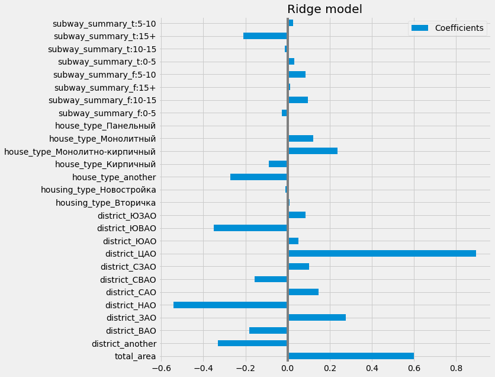

# Real Estate Market Analysis #

## Описание проекта ##

Данный проект представляет собой анализ рынка жилой недвижимости в Москве и состоит из следующих частей:

1. **Парсинг данных с сайта [ЦИАН](https://www.cian.ru)**
  
    На данном этапе была получена ифнормация по 10000 объявлений по продаже жилья. С целью получения репрезентативной выборки, структура полученных даных (соотношение первичного и вторичного жилья, соотношение 1, 2, 3 комнатных квартир и т. д.) определена в соответствии со структурой всего рынка жилой недвижимости Москвы.
  
2. **Предобработка полученных данных**

    Обработка пропущенных значений, преобразование исходных данных в удобный для дальнейшего анализа вид, первичный отбор признаков для будующих моделей.
  
3. **Разведочный анализ данных**

    Визуализация полученных данных, расчёт различных статистик и их анализ, построение дополнительных признаков.
  
4. **Построение моделей предсказания цены на квартиру**

    Включает в себя построение Ridge regression, KNeighborsRegressor и Support Vector Regression. Подбор оптимальных гиперпараметров для каждой из моделей и выбор лучшей из представленных моделей. Также проводится анализ коэффициентов полученной Ridge regression модели, с целью выявления наиболее позитивно и негативно влияющих на цену квартиры признаков.

## Результаты исследования ## 

В качестве основных признаков для построения моделей предсказания цены были отобраны следующие характеристики:
- 12 административных округов города Москва
- Тип жилья (Новостройка или вторичка)
- Тип дома (Панельный, монолитный, кирпичный, монолитно-кирпичный и другой)
- Общая площадь квартиры в квадратных метрах
- Категориальная переменная, содержащая в себе информацию о ближайшем метро: способ достижения ближайшего метро (пешком или на транспорте) и время до ближайшего метро в минутах (временные интервалы 0-5, 5-10, 10-15, 15+).

*Помимо основных признаков, для построения дополнительных моделей использовались дата постройка дома и номер этажа квартиры*

| Model:       	| Ridge             	|                   	|                	| KNN                	|                    	|                    	| SVR                                       	|                                            	|                                            	|
|--------------	|-------------------	|-------------------	|----------------	|--------------------	|--------------------	|--------------------	|-------------------------------------------	|--------------------------------------------	|--------------------------------------------	|
| Features:    	| standart features 	| + house buld date 	| + floor number 	| standart features  	| + house buld date  	| + floor number     	| standart features                         	| + house buld date                          	| + floor number                             	|
| Optim params 	| {'alpha': 1.0}    	| {'alpha': 1.0}    	| {'alpha': 1.0} 	| {'n_neighbors': 3} 	| {'n_neighbors': 3} 	| {'n_neighbors': 5} 	| {'C': 1, 'epsilon': 0.1, 'kernel': 'rbf'} 	| {'C': 10, 'epsilon': 0.1, 'kernel': 'rbf'} 	| {'C': 10, 'epsilon': 0.1, 'kernel': 'rbf'} 	|
| LMSE         	| 0.184053          	| 0.178878          	| 0.178739       	| 0.098854           	| 0.106193           	| 0.146651           	| 0.092428                                  	| 0.086377                                   	| 0.081788                                   	|
| LRMSE        	| 0.429014          	| 0.422940          	| 0.422776       	| 0.314410           	| 0.325873           	| 0.382951           	| 0.304020                                  	| 0.293899                                   	| 0.285986                                   	|
| R-Squared    	| 0.831380          	| 0.836121          	| 0.836248       	| 0.909435           	| 0.902711           	| 0.865645           	| 0.915322                                  	| 0.920866                                   	| 0.925070                                   	|

**Таким образом, лучшей моделью оказалась Support Vector Regression с R-squared = 0.925**

*На следующем графике можно увидеть значения коэффициентов Ridge Regression:*

 
**На основе данного графика можно выделить следующие признаки, влияющие на цену сильнее всего:**
- Общая площать квартиры (+)
- Расположение квартиры в пределах ЦАО (+)
- Монолитно-кирпичный тип дома (+)
- Расположение квартиры в 5-15 минутах хотьбы от ближайшего метро (+)
- Расположение квартиры в пределах НАО или ЮВАО (-)
- Расположение квартиры в более чем 15 минутах езды на траспорте от ближайшего метро (-)

** более подробно с результатами исследования можно ознакомиться в файле apartments_data_analysis.ipynb
  
## Структура проекта ##

*Данный проект разбит на следующие модули:*
- **parsers**
  - apartments_links_parser.py - основные функции по сбору ссылок на квартиры
  - apartments_info_parser.py - описание функций по парсингу объявлений квартир
  - data_collection.py - вызывается сбор ссылок на квартиры с их последующим парсингом
- **apartments_data**
  - apartments_links.csv - содержит полученные ссылки на квартиры
  - apartments_database.csv - содержит всю собранную информацию по квартирам
- **data_preprocessing**
  - preprocessing.py - основные функции по предобработки данных, полученных после парсинга
  - get_preprocessed_dataframes.py - формирование готовых к разведочному анализу данных датафреймов
- **preprocessed_dataframes**
  - apartments.csv - содержит предобработанные данные по всем квартирам
  - secondary_apartments.csv - содержит предобработанные данные только по вторичному жилью
- **modeling**
  - feature_extraction.py - функции по извлечению признаков
  - modeling_steps_functions.py - функции, описывающие этапы построения моделей
  - models_creating.py - построение моделей, запись их результатов и их сохранение
- **models_storage** - содержит результаты построения моделей modeling_results.csv, а также все построенные модели в формате .joblib
- **tests**
  - parser_test.py - unit-тесты, тестирующие парсер данных
  - test_constants.py - содержит необохдимые для тестирования константы
- **apartments_data_analysis.ipynb** - разведочный анализ данных со всей необохдимой визуализацией
